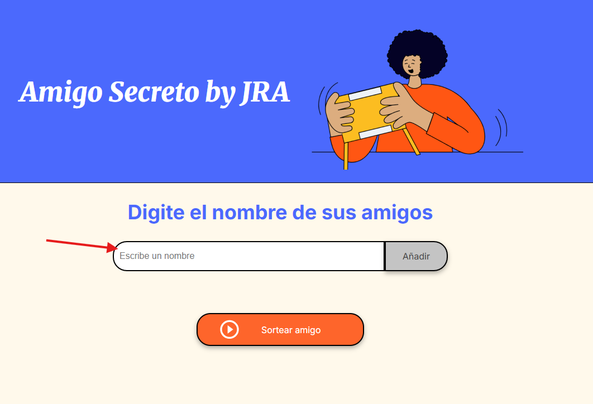
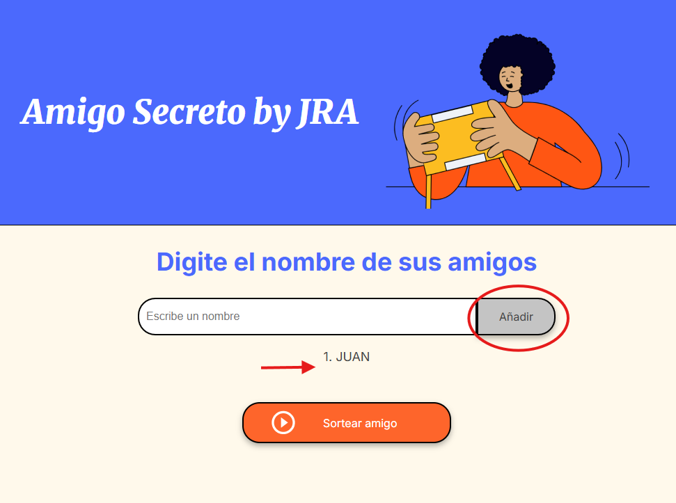
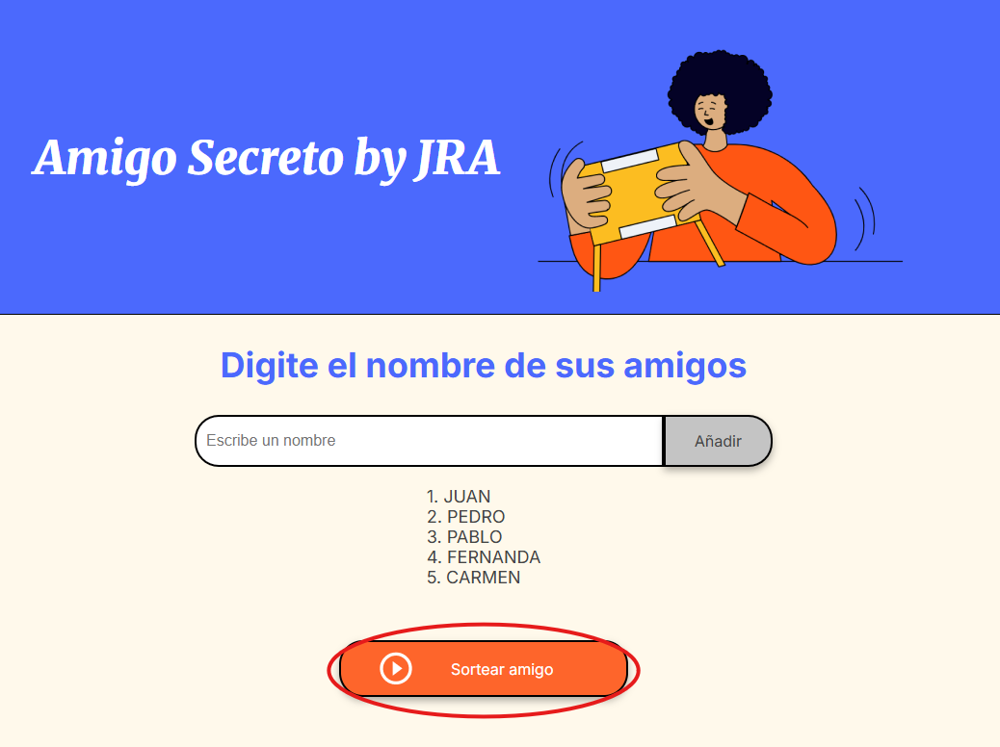
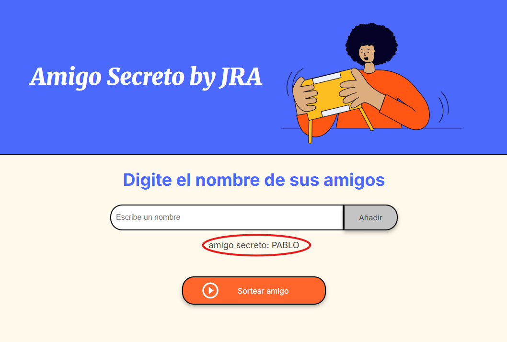
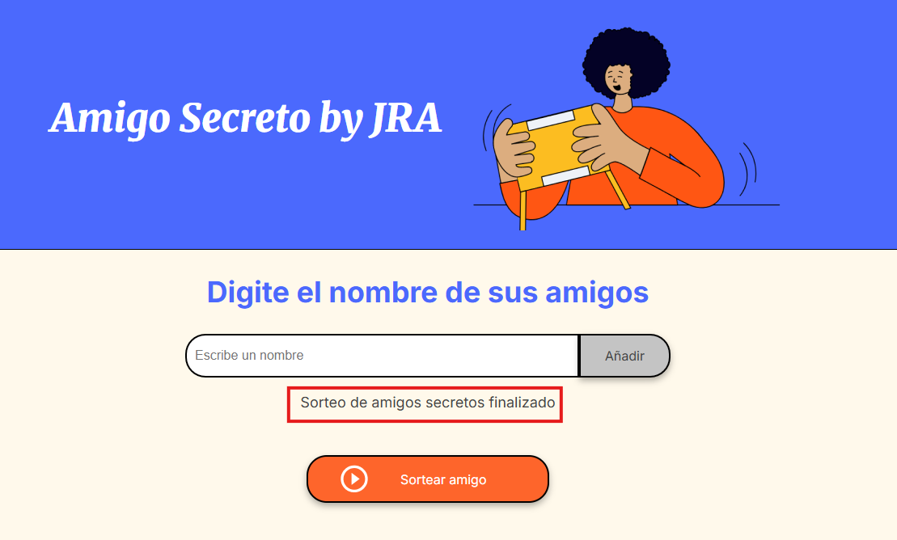

# Sorteo-Challenge

Se desarrolló un programa que permite ingresar el nombre de los participantes para una dinámica de "Amigo Secreto".

1. Introducen el nombre de los participantes, uno por uno.

2. Presionan el botón "Añadir" para generar la base de datos de los participantes.

Ya terminado el registro de participantes, ¡empieza lo divertido!
Es momento de iniciar el sorteo.
3.Oprime el botón "Sortear amigo" para generar el primer "amigo secreto".

4. No olvides guardar el nombre de tu "amigo secreto", ya que no podrás recuperarlo, y se tendrá que realizar todo desde el inicio.

5. Cuando todos los nombres hayan salido, aparecerá el mensaje:
"Sorteo de amigos secretos finalizado"

Solo queda ¡disfrutar de la dinámica!

JRA

